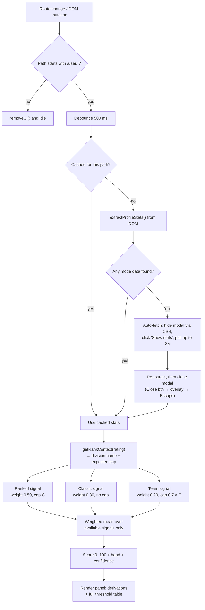

<div align="center">

# 📊 GeoGuessr Profile Anomaly Score

**Rank-aware smurf detection for GeoGuessr profiles — with an explicitly mapped math breakdown and visible threshold caps.**

A zero-dependency userscript that reads a public GeoGuessr profile, stabilizes its win rates against small-sample noise, compares match volume to what the player's division actually demands, and renders a transparent, step-by-step derivation of every number it shows you — including the full threshold table it judged against. Available in English, Turkish, Estonian, French and German.

[](geoguessr-profile-anomaly-score.js)
[](#-changelog)
[](LICENSE)
[](#-languages)
[](#design-principles)
[](#-privacy--permissions)
[](geoguessr-profile-anomaly-score.js)

[**Live demo**](https://anomaly.magnusmagi.com) · [Install](#-installation) · [How it works](#-how-it-works) · [The math](#-the-math-in-full) · [Thresholds](#-division--threshold-reference) · [Languages](#-languages) · [FAQ](#-faq)

</div>

---

> [!IMPORTANT]
> **This is an anomaly indicator, not a cheat verdict.**
> A high score means *"this statistical profile is unusual for this division"* — nothing more. Legitimate returning players, alt accounts of honest veterans, and small-sample outliers all produce elevated scores. Never use this output as the sole basis for accusing, reporting, or harassing another player.

---

## Table of Contents

- [Why this exists](#-why-this-exists)
- [Features](#-features)
- [Installation](#-installation)
- [Quick start](#-quick-start)
- [How it works](#-how-it-works)
- [The math, in full](#-the-math-in-full)
  - [1. Stabilized win rate](#1-stabilized-win-rate-empirical-bayes-shrinkage)
  - [2. The risk curve](#2-the-risk-curve)
  - [3. The smurf boost](#3-the-smurf-boost-rank-awareness)
  - [4. The classic signal](#4-the-classic-signal)
  - [5. Aggregation](#5-aggregation)
- [Division & threshold reference](#-division--threshold-reference)
- [Languages](#-languages)
- [Reading the panel](#-reading-the-panel)
- [Configuration](#-configuration)
- [Architecture](#-architecture)
- [Privacy & permissions](#-privacy--permissions)
- [Known limitations](#-known-limitations)
- [Troubleshooting](#-troubleshooting)
- [FAQ](#-faq)
- [Changelog](#-changelog)
- [Roadmap](#-roadmap)
- [Contributing](#-contributing)
- [License](#-license)

---

## 🎯 Why this exists

Every competitive GeoGuessr player has had the same moment: you lose a Ranked Duel to an account with a Champion badge and 40 lifetime matches, and you wonder whether you just got outplayed or just met a smurf.

The raw numbers on a profile page can't answer that on their own:

| The naive read | Why it's wrong |
|---|---|
| "70% win rate — suspicious!" | Over **10 matches**, 70% is a coin flip landing 7 heads. It happens constantly. |
| "80 matches — that's nothing!" | For a **Silver** player, 80 matches is a complete, normal career. |
| "2,100 rating — obviously legit" | Not if they got there in **60 games** with an 84% win rate. |

Each number is meaningless alone. **Win rate needs sample-size correction. Match count only means something relative to division. And both need to be weighed against the other modes the account plays.**

This script does all three, and then — critically — **shows you the arithmetic**. Every percentage in the panel comes with the exact expression that produced it, and since v6.2.0 the panel also prints the **entire threshold table** it judged the player against. You can disagree with the model instead of trusting a black box.

---

## ✨ Features

<table>
<tr>
<td width="50%" valign="top">

### 🧮 Explicit math breakdown
Every signal renders its own derivation chain — stabilized win rate → risk curve → smurf multiplier → applied signal — with the real numbers substituted in. No hidden weights, no "trust me" scores.

</td>
<td width="50%" valign="top">

### 📋 Visible threshold caps
**New in 6.2.0.** The panel prints the full expected-match table inline, so you can see *every* division's cap — not just your subject's — and judge whether the calibration is fair.

</td>
</tr>
<tr>
<td width="50%" valign="top">

### 🏆 Rank-aware thresholds
A 10-tier division ladder maps each rating band to an *expected match count*. 80 games at Silver is unremarkable; 80 games at Champion 1.9k+ is a five-alarm signal. The model knows the difference.

</td>
<td width="50%" valign="top">

### ⚖️ Recalibrated "fair caps"
6.2.0 lowered every threshold by 30–40% and consolidated 14 tiers into 10. The old table over-flagged efficient climbers; the new one demands a clearer mismatch before firing.

</td>
</tr>
<tr>
<td width="50%" valign="top">

### 🤖 Auto-fetch of hidden stats
Detailed per-mode stats live behind GeoGuessr's **"Show stats"** comparison modal. The script opens it invisibly, harvests the values, and closes it — you never see a flicker.

</td>
<td width="50%" valign="top">

### 📉 Small-sample shrinkage
Win rates are pulled toward 50% by 50 phantom matches (empirical-Bayes style), so a 9-1 hot streak on a fresh account can't spike the score the way a 900-100 record does.

</td>
</tr>
<tr>
<td width="50%" valign="top">

### 🌍 Locale-proof number parsing
`1.234,5` and `1,234.5` and `1 234` all parse correctly. The script infers the decimal separator from separator *position* rather than assuming a locale.

</td>
<td width="50%" valign="top">

### 🧭 SPA-native routing
GeoGuessr is a client-routed app. The script patches `pushState`/`replaceState`, listens to `popstate`, and watches the DOM — so it re-analyzes the moment you navigate to a new profile.

</td>
</tr>
<tr>
<td width="50%" valign="top">

### 🌐 Five languages
**New in 6.4.0.** The entire panel — including every line of the math derivation — speaks English, Turkish, Estonian, French and German. Auto-detected, with a picker in the header.

</td>
<td width="50%" valign="top">

### 🔎 Language-agnostic stat fetching
The **Show stats** button is found by GeoGuessr's own component classes plus the `stat` root that every supported language shares, so auto-fetch works whatever locale the site is rendering in.

</td>
</tr>
<tr>
<td width="50%" valign="top">

### 🖱️ Draggable, dismissible panel
Grab the header and move it anywhere. Close it and it collapses into a slim edge tab; click **📊 Analyze** to bring it back. Your dismissal is respected until you change pages.

</td>
<td width="50%" valign="top">

### ⚡ Zero dependencies, zero network
No libraries, no bundler, no build step, no `@grant`, no external requests, no telemetry. One file, 1,215 lines, MIT.

</td>
</tr>
</table>

---

## 📦 Installation

### Step 1 — Install a userscript manager

| Browser | Recommended manager |
|---|---|
| Chrome / Edge / Brave / Opera | [Tampermonkey](https://www.tampermonkey.net/) or [Violentmonkey](https://violentmonkey.github.io/) |
| Firefox | [Violentmonkey](https://violentmonkey.github.io/) or [Tampermonkey](https://www.tampermonkey.net/) |
| Safari | [Userscripts](https://apps.apple.com/app/userscripts/id1463298887) |

### Step 2 — Install the script

**Option A — one click (recommended)**

Open the raw file; your manager will intercept it and show the install prompt:

```
https://raw.githubusercontent.com/MagnusMagi/GeoGuessr-Profile-Anomaly-Score/main/geoguessr-profile-anomaly-score.js
```

**Option B — manual**

1. Open your userscript manager's dashboard → **Create a new script**
2. Delete the template contents
3. Paste the entire contents of [`geoguessr-profile-anomaly-score.js`](geoguessr-profile-anomaly-score.js)
4. Save (<kbd>Ctrl</kbd>/<kbd>Cmd</kbd> + <kbd>S</kbd>)

### Step 3 — Verify

Navigate to any GeoGuessr profile — e.g. `https://www.geoguessr.com/user/<id>` — and the panel should appear top-right within about half a second.

> [!WARNING]
> **Upgrading from an older release?** Userscript managers key script identity on `@namespace` + `@name`, and the `@namespace` has changed twice: 1.0.0 used the repository URL, 6.2.0–6.3.0 used a `https://example.local/…` placeholder, and 6.4.0 points back at the script file in this repository. Installing 6.4.0 on top of a 6.2.0/6.3.0 install therefore creates a **second, duplicate script** instead of updating it — leaving two panels fighting for the same corner. Delete the old entry from your manager's dashboard first. Upgrades from 1.0.0, and everything from 6.4.0 onward, update cleanly.

<details>
<summary><b>Userscript header reference</b></summary>

```js
// ==UserScript==
// @name         GeoGuessr Profile Anomaly Score
// @namespace    https://github.com/MagnusMagi/GeoGuessr-Profile-Anomaly-Score/blob/main/geoguessr-profile-anomaly-score.js
// @version      6.5.0
// @description  Rank-aware smurf detection with auto-fetch, explicit math breakdown, and measured-calibration thresholds. Available in English, Turkish, Estonian, French and German.
// @match        https://www.geoguessr.com/*
// @license      MIT
// @grant        none
// ==/UserScript==
```

`@match` covers the whole domain so SPA navigation works, but **the script only activates on paths beginning with `/user/`** (`isProfilePage()`). On every other page it removes its own UI and idles.

</details>

---

## 🚀 Quick start

1. Open any player profile on GeoGuessr.
2. Wait ~0.5s — the analysis panel appears in the top-right corner.
3. Read the headline score, then scroll the panel for:
   - **Rank context** — division, rating, expected match count
   - **Raw Data Summary** — each mode's contribution and underlying numbers
   - **How is this calculated?** — the model in four bullets, **plus the full cap table**
   - **Personal Math Breakdown** — the complete derivation for *this* profile
4. Drag the header to reposition. Hit **×** to collapse to the edge tab.

---

## 🔬 How it works



### Data acquisition, in detail

The script tries **three** extraction strategies, in order of quality:

1. **Stat comparison modal** (`[class*="stat-comparison-modal_grid"]`) — the richest source. The script walks the grid linearly, tracking the current *mode* header (`classic`, `ranked duels`, `ranked team duels`) and *sub-mode* subheader, and reads the **opponent column** (`label → you → other`) for Completed Games, Avg. Score, Played, and Win Ratio. All-time rating is read from the `all-time rating → all` cell.
2. **Profile widgets** — if no modal is present, it falls back to scanning `h1/h2/h3` headings inside `widget_widgetBorder` / `widget_widgetOuter` containers and pairing each label `<span>` with its preceding value element.
3. **Rating text scan** — as a last resort for rating alone, it searches for a `div` containing `"Current rating:"` and reads its `<strong>`.

If none of those yield mode data, **auto-fetch** kicks in: a temporary stylesheet (`#geo-temp-hide-modal`) makes the comparison modal fully invisible and non-interactive, the **"Show stats"** button is clicked programmatically (English and Turkish labels both matched), and a 50 ms poll waits up to **40 ticks (~2 s)** for numeric cells to populate. The modal is then dismissed via `button[aria-label="Close"]` → overlay click → synthetic <kbd>Escape</kbd>, whichever lands first, and the hiding stylesheet is removed 100 ms later.

Successful extractions are cached in `hiddenStatsCache`, **keyed by pathname**, so revisiting a profile in the same session costs nothing.

---

## 🧮 The math, in full

Let:

- $G$ = completed matches in a mode
- $W$ = raw win rate in that mode, as a percentage
- $R$ = all-time rating
- $C$ = expected match cap for the player's division

### 1. Stabilized win rate (empirical-Bayes shrinkage)

A raw win rate over 12 games tells you almost nothing. The model adds **50 phantom matches at exactly 50%**, pulling small samples toward the mean while leaving large samples essentially untouched:

$$\hat{W} = \frac{G \cdot \mathrm{clamp}(W/100) + 50 \cdot 0.5}{G + 50}$$

| Record | Raw win rate | Stabilized $\hat{W}$ | Effect |
|---|---|---|---|
| 7 – 3 | 70.0% | **53.3%** | Streak almost fully absorbed |
| 40 – 20 | 66.7% | **59.1%** | Meaningfully discounted |
| 200 – 100 | 66.7% | **64.3%** | Lightly discounted |
| 900 – 450 | 66.7% | **66.1%** | Essentially unchanged |

> This is the single most important line of defense against false positives. It's why a hot new account doesn't automatically look like a cheater.

### 2. The risk curve

The stabilized rate is mapped through a piecewise curve. Below 56% there is **no signal at all** — that band is simply "a good player". Above it, the response steepens:

$$
S_{\text{base}}(\hat{W}) =
\begin{cases}
0 & \hat{W} \le 0.56 \\\\[6pt]
\dfrac{\hat{W} - 0.56}{0.06} \times 0.25 & 0.56 < \hat{W} \le 0.62 \\\\[6pt]
0.25 + \dfrac{\hat{W} - 0.62}{0.08} \times 0.35 & 0.62 < \hat{W} \le 0.70 \\\\[6pt]
\mathrm{clamp}\left(0.60 + \dfrac{\hat{W} - 0.70}{0.30} \times 0.25\right) & \hat{W} > 0.70
\end{cases}
$$

| Stabilized win rate | Base signal | Interpretation |
|---|---|---|
| ≤ 56% | 0% | Normal-to-strong |
| 58% | 8.3% | Slight |
| 62% | 25% | Notable |
| 66% | 42.5% | Strong |
| 70% | 60% | Very strong |
| 80% | 68.3% | Extreme |
| 90% | 76.7% | Extreme |

The curve deliberately **flattens above 70%** — once a rate is that far out, additional wins add little information, and the smurf term below takes over as the dominant discriminator.

### 3. The smurf boost (rank awareness)

This is the part that makes the model *rank-aware*, and it's what separates it from a plain win-rate flag.

It applies **only when both conditions hold**:

- $R \ge 600$ — the account has actually climbed somewhere meaningful, **and**
- $G \lt C$ — it got there in fewer matches than its division normally takes

$$
\text{deficit} = \mathrm{clamp}\left(\frac{C - G}{C}\right)
\qquad
S_{\text{smurf}} = \text{deficit} \times \mathrm{clamp}(W/100)
$$

The two factors multiply, which means **both** have to be true for the term to fire. A player with 30 matches and a 45% win rate has a huge deficit but a weak rate, so the product stays small. A player with 30 matches and an 85% win rate at Champion produces a very large product.

The mode's final signal takes whichever term is more alarming:

$$S = \mathrm{clamp}\big(\max(S_{\text{base}}, S_{\text{smurf}})\big)$$

> **Team Duels use a reduced cap of $0.7 \times C$** — team modes are played less often than solo Ranked, so demanding the same volume would over-flag ordinary players.

<details>
<summary><b>Worked example — Champion 1.9k+ (1950), 60 matches, 84% win rate</b></summary>

```
Division cap C for rating 1950  →  2500
Stabilized:  (60 × 0.84 + 50 × 0.5) / (60 + 50)  =  0.6855  → 68.5%
Risk curve:  0.25 + (0.6855 − 0.62)/0.08 × 0.35  =  0.5366  → 53.6%
Deficit:     (2500 − 60) / 2500                  =  0.9760
Smurf term:  0.9760 × 0.84                       =  0.8198  → 82.0%
Applied:     max(53.6%, 82.0%)                   =  82.0%
```

The rank term dominates by a wide margin — exactly the intended behavior. A 60-game account sitting at Champion is the signal; the win rate is merely the confirmation.

</details>

<details>
<summary><b>Worked example — Gold (780), 400 matches, 61% win rate</b></summary>

```
Division cap C for rating 780    →  200
Stabilized:  (400 × 0.61 + 25) / 450  =  0.5978  → 59.8%
Risk curve:  (0.5978 − 0.56)/0.06 × 0.25  =  0.1574  → 15.7%
Smurf term:  not applied (400 matches ≥ 200 cap)
Applied:     15.7%
```

A strong, well-established Gold player. Low signal, as it should be.

</details>

<details>
<summary><b>Worked example — what the 6.2.0 cap change actually does</b></summary>

Same player, same numbers, judged by the old and new Gold caps. Rating 780, **120 matches, 70% win rate**:

```
Stabilized:  (120 × 0.70 + 25) / 170  =  0.6412  → 64.1%
Risk curve:  0.25 + (0.6412 − 0.62)/0.08 × 0.35  =  0.3427  → 34.3%

1.0.0 (cap 250):  deficit (250−120)/250 = 0.52  →  smurf 0.52 × 0.70 = 36.4%
                  Applied: max(34.3%, 36.4%)    =  36.4%   ← rank term drives it

6.2.0 (cap 200):  deficit (200−120)/200 = 0.40  →  smurf 0.40 × 0.70 = 28.0%
                  Applied: max(34.3%, 28.0%)    =  34.3%   ← win rate drives it
```

The score barely moves, but the *reason* changes: under the new caps, 120 games at Gold is no longer treated as suspiciously few, and the player is judged on performance instead of volume. Multiply that across every tier and you have the substance of the recalibration.

</details>

### 4. The classic signal

Classic games have no win rate, so anomaly is derived from **average score**, then scaled by how much evidence supports it:

$$
S_{\text{score}} =
\begin{cases}
0 & A \le 18{,}000 \\\\[6pt]
\dfrac{A - 18{,}000}{2{,}000} \times 0.6 & 18{,}000 < A \le 20{,}000 \\\\[6pt]
0.6 + \dfrac{A - 20{,}000}{5{,}000} \times 0.4 & A > 20{,}000
\end{cases}
\qquad
E = \mathrm{clamp}\left(\sqrt{\frac{G}{1500}}\right)
$$

$$S_{\text{classic}} = \mathrm{clamp}(S_{\text{score}} \times E)$$

The **confidence multiplier** $E$ reaches its ceiling of 1.0 at 1,500 games; a player with 150 classic games gets their score anomaly multiplied by only $\sqrt{0.1} \approx 0.32$. A 24k average over 20 games barely registers; the same average over 2,000 games is close to unanswerable.

> Classic is the one signal the **cap recalibration did not touch** — it has no rank term at all.

<details>
<summary><b>Worked example — 800 classic games, 19,500 avg score</b></summary>

```
Score anomaly:  (19500 − 18000) / 2000 × 0.6  =  0.45   → 45.0%
Evidence:       √(800 / 1500)                 =  0.73
Applied:        45.0% × 0.73                  =  32.9%
```

</details>

### 5. Aggregation

Each available signal carries a fixed weight, and the score is a weighted mean **normalized over only the signals that were actually found**:

| Signal | Weight | Cap used | Requires |
|---|---|---|---|
| 🥇 Ranked Duels | **0.50** | $C$ | games + win rate |
| 🌍 Classic | **0.30** | — | games + avg. score |
| 👥 Team Duels | **0.20** | $0.7 \times C$ | games + win rate |

$$\text{Score} = 100 \times \frac{\sum_i w_i S_i}{\sum_i w_i}$$

Because the denominator only sums the weights present, a profile with Ranked data alone is scored on Ranked alone — not silently penalized (or rewarded) for the missing modes. What *does* change is the reported confidence:

| Signals found | Confidence |
|---|---|
| 3 | **High** |
| 2 | **Medium** |
| 1 | **Low** |
| 0 | *Insufficient data* — no score is shown |

### Score bands

| Score | Band | Badge colour |
|---|---|---|
| 0 – 19.9 | 🟢 **Low** | green |
| 20 – 44.9 | 🟡 **Limited** | amber |
| 45 – 69.9 | 🟠 **High** | orange |
| 70 – 100 | 🔴 **Very High** | red |

---

## 🏅 Division & threshold reference

`getRankContext(rating)` maps rating to a division label and an **expected match count** — the volume a legitimate player typically needs to reach that band. This table *is* the model's notion of "normal", and since 6.2.0 the panel prints it inline so users can audit it without reading the source.

Since 6.5.0, every cap is the **median ranked-duels games played** for real players in that rating cohort, sampled from [magnusgeo.magnusmagi.com/median](https://magnusgeo.magnusmagi.com/median) (100-point rating bands, weighted by cohort size where a division spans more than one band):

| Rating | Division | Expected matches ($C$) | Team cap ($0.7C$) | Cohort $n$ |
|---:|---|---:|---:|---:|
| < 400 | Bronze | 28 | 20 | 1,725 |
| 400 – 599 | Silver | 78 | 55 | 20,379 |
| 600 – 849 | Gold | 280 | 196 | ≈14,573 |
| 850 – 1099 | Master | 1,375 | 963 | ≈2,538 |
| 1100 – 1199 | Champion (1.1k) | 3,310 | 2,317 | 368 |
| 1200 – 1299 | Champion (1.2k) | 4,821 | 3,375 | 206 |
| 1300 – 1499 | Champion (1.3k–1.4k) | 7,342 | 5,139 | 226 |
| 1500 – 1699 | Champion (1.5k–1.6k) | 12,649 | 8,854 | 104 |
| 1700 – 1899 | Champion (1.7k–1.8k) | 17,942 | 12,559 | 15 |
| ≥ 1900 | Champion (1.9k+) | 34,743 | 24,320 | 1 ⚠️ |

If rating cannot be read at all, the context falls back to `{ name: "Unknown", cap: 600 }`.

> [!WARNING]
> **The top two rows rest on a thin sample.** `/median` had 15 profiled players between 1700–1899 and exactly **one** at 1900+ (34,743 lifetime ranked games). That single point *is* the 1.9k+ cap until more players are profiled — treat scores near that boundary as lower-confidence than the rest of the table. Everything from Bronze through Champion 1.2k rests on hundreds to tens of thousands of players and is comparatively solid.

> [!NOTE]
> **The smurf term never fires below rating 600.** Bronze and Silver accounts are exempt by design — a low-rated account with few games is just a new player, not a smurf.

### What the 6.2.0 recalibration changed

Every threshold came down, and the top of the ladder was consolidated from nine Champion tiers into five:

| Division | 1.0.0 cap | 6.2.0 cap | Change |
|---|---:|---:|---:|
| Bronze | 50 | 30 | −40% |
| Silver | 100 | 80 | −20% |
| Gold | 250 | 200 | −20% |
| Master | 500 | 350 | −30% |
| Champion 1.1k | 600 | 500 | −17% |
| Champion 1.2k | 800 | 700 | −13% |
| Champion 1.3k–1.4k | 1,000 / 1,200 | 900 | −10% to −25% |
| Champion 1.5k–1.6k | 1,500 / 1,800 | 1,200 | −20% to −33% |
| Champion 1.7k–1.8k | 2,200 / 2,600 | 1,600 | −27% to −38% |
| Champion 1.9k+ | 3,000 / 4,000 | 2,500 | −17% to −38% |

The direction is consistent: **fewer false positives at the top of the ladder.** The old table assumed a Champion 2k+ player needed 4,000 matches, which flagged efficient climbers who simply improved fast. The new cap of 2,500 demands a much clearer volume mismatch before the smurf term contributes anything.

The tradeoff is real and worth naming: **a genuine smurf sitting between the old and new caps now scores lower than it used to.** 6.2.0 trades some sensitivity for a lot of precision.

### What the 6.5.0 recalibration changed

6.2.0's caps were a **prior** — a reasonable guess at progression speed, tuned down to avoid flagging efficient climbers. 6.5.0 replaces the guess with **measured data**: median ranked-duels games played per rating cohort, from [magnusgeo.magnusmagi.com/median](https://magnusgeo.magnusmagi.com/median).

| Division | 6.2.0 cap | 6.5.0 cap | Change |
|---|---:|---:|---:|
| Bronze | 30 | 28 | −7% |
| Silver | 80 | 78 | −3% |
| Gold | 200 | 280 | +40% |
| Master | 350 | 1,375 | +293% |
| Champion 1.1k | 500 | 3,310 | +562% |
| Champion 1.2k | 700 | 4,821 | +589% |
| Champion 1.3k–1.4k | 900 | 7,342 | +716% |
| Champion 1.5k–1.6k | 1,200 | 12,649 | +954% |
| Champion 1.7k–1.8k | 1,600 | 17,942 | +1,021% |
| Champion 1.9k+ | 2,500 | 34,743 | +1,290% |

Bronze and Silver barely moved — the 6.2.0 priors happened to be close. Everything from Gold up moved sharply **higher**, in the opposite direction from 6.2.0: it turns out real players need far more games to reach Master and Champion than either the 1.0.0 or the 6.2.0 table assumed. Under the old, too-low caps, `games ≥ expectedCap` was true for the overwhelming majority of legitimate high-division players, so the smurf term rarely contributed anything above Gold — 6.2.0 wasn't just conservative there, it was close to inert. 6.5.0 restores real sensitivity at the top of the ladder, backed by a measured baseline instead of a guess.

This does reintroduce some of the false-positive risk 6.2.0 was written to avoid, for players who climbed unusually efficiently. See the [top-of-table sample-size warning](#-division--threshold-reference) — the 1.9k+ cap is one data point.

---

## 🌐 Languages

The panel ships in five languages. Every user-facing string is translated, including the per-mode math derivation — there is no half-localized state where the headline is translated but the reasoning underneath is still English.

| Code | Language | Number format | Notes |
|---|---|---|---|
| `en` | English | `19,500` | Source language |
| `tr` | Türkçe | `19.500` | Percent written as `%84`, per Turkish convention |
| `et` | Eesti | `19 500` | Also selected by `ee`, see below |
| `fr` | Français | `19 500` | Narrow space before `:` and `%`, per French typography |
| `de` | Deutsch | `19.500` | Space before `%`, per German typography |

Numbers are formatted with `toLocaleString` in the active locale, so thousands separators follow the reader's convention rather than always being English commas.

### How the language is chosen

1. **GeoGuessr's own interface language**, read from `<html lang>`.
2. **Your browser's preference list**, `navigator.languages`, taking the first supported entry.
3. **English**, if nothing matches.

Region subtags are ignored, so `de-DE`, `fr_CA` and `et-EE` all resolve correctly.

> [!NOTE]
> `EE` is the *country* code for Estonia; the *language* code is `et`. Both are accepted and map to Estonian, because they get used interchangeably in practice.

### Changing it

The panel header has a picker listing each language in its own name — `English`, `Türkçe`, `Eesti`, `Français`, `Deutsch`. Switching is instant and **re-reads nothing from the page**: the last extracted stats are kept in memory and the whole panel is simply re-derived, so the score cannot change when the language does.

The choice lasts for the session. It is deliberately **not** written to `localStorage`, which keeps the "no persistent storage" guarantee in [Privacy & permissions](#-privacy--permissions) literally true. Auto-detection means most users never need to touch the picker anyway.

### What is *not* translated

- **Division names** — `Bronze`, `Gold`, `Champion (1.9k+)` and so on are GeoGuessr's own badge names, kept as-is so they match the badge rendered on the profile. Only the `Unknown` fallback is localized.
- **The formulas themselves** — `(60 * 84.0% + 50 * 50%) / (60 + 50) = 68.5%` is arithmetic and reads the same everywhere. Only the *labels* around it are translated.

### Finding the "Show stats" button in any locale

Auto-fetch has to click GeoGuessr's own button, whose label is in **GeoGuessr's** interface language — not the panel's. That button is:

```html
<button class="button_button__HASH button_variantTertiary__HASH button_sizeSmall__HASH">
  <div class="button_wrapper__HASH">
    <span class="button_label__HASH">Show stats</span>
  </div>
</button>
```

Matching is two-layered, because neither layer is sufficient alone:

- **Structure** — `button[class*="button_button__"]`, reading the label from `[class*="button_label__"]`. Only the stable CSS-module prefixes are used, so a new deploy that rehashes the class names doesn't break it. But structure alone is ambiguous: *Follow*, *Challenge* and *Report* are the same tertiary small button.
- **The `stat` root** — which every supported language happens to share:

| Language | Label | Contains |
|---|---|---|
| English | Show **stat**s | ✅ |
| Türkçe | i̇**stat**istikleri göster | ✅ |
| Eesti | Näita **stat**istikat | ✅ |
| Français | Afficher les **stat**istiques | ✅ |
| Deutsch | **Stat**istiken anzeigen | ✅ |

So the exact wording never has to be right — only the root. The full labels are still listed in the source for precision and documentation. Polish, Dutch, Swedish, Italian and Portuguese match for free as a side effect; Spanish (*Estadísticas*) does not, since it uses a `stad` root.

If the component classes ever disappear entirely, the finder falls back to scanning every `<button>` on the page.

### Adding a language

1. Add an entry to `LANGUAGES` with its `code`, native `label` and `numberLocale`.
2. Add a matching block to `STRINGS` — copy the `en` block and translate the values, keeping every `{placeholder}` exactly as it appears in the English source.
3. If the language's word for "statistics" does not contain `stat`, add its **Show stats** label to `SHOW_STATS_LABELS`.

Missing keys fall back to English rather than rendering blank, so a partial translation degrades gracefully.

> Translations were produced by the author, not by native speakers of every language. Corrections are very welcome — especially for Estonian, and for any term that should match GeoGuessr's own in-game wording.

---

## 🖼️ Reading the panel

```
┌────────────────────────────────────────────┐
│ 📊 Profile Analysis        [English ▾]   × │  ← drag here to move
├────────────────────────────────────────────┤
│  🏆  Champion (1.9k+) (1950)               │  ← rank context
│      Expected matches: ~2500               │
│                                            │
│  STATISTICAL ANOMALY SCORE                 │
│  77.3%          [ Very High · Medium conf ]│  ← headline + band
│                                            │
│  This score is a statistical anomaly       │
│  indicator; not a definitive cheat verdict.│
│  ──────────────────────────────────────    │
│  Raw Data Summary                          │
│   Ranked: Mode Impact 71% (Anomaly 82.0%)  │  ← weight share
│     ↳ 60 matches, 84% win rate             │
│   Team:   Mode Impact 29% (Anomaly 65.5%)  │
│     ↳ 12 matches, 66% win rate             │
│  ──────────────────────────────────────    │
│  How is this calculated?                   │  ← model summary
│   · Stabilization  · Risk Curve            │
│   · Smurf Boost    · Weights               │
│  ──────────────────────────────────────    │
│  Expected Match Thresholds (Caps)          │  ← NEW in 6.2.0
│   Bronze: 30 | Silver: 80 | Gold: 200 |    │
│   Master: 350                              │
│   Champ 1.1k: 500 | 1.2k: 700 | 1.4k: 900  │
│   Champ 1.6k: 1200 | 1.8k: 1600 |1.9k+:2500│
│  ──────────────────────────────────────    │
│  Personal Math Breakdown                   │  ← per-mode derivation
│   Ranked Mode Details:                     │
│     Stabilized Win Rate                    │
│     (60 * 84.0% + 50 * 50%) / (60+50)=68.5%│
│     Base Anomaly (Risk Curve)      53.6%   │
│     Smurf Multiplier                       │
│     (2500-60)/2500 * 84.0%         82.0%   │
│     ─ ─ ─ ─ ─ ─ ─ ─ ─ ─ ─ ─ ─ ─ ─ ─ ─ ─   │
│     Applied Signal: Max(53.6%,82.0%)=82.0% │
│                                            │
│   Final Weighted Score:                    │
│     Calculation: (82.0% * 71%)             │
│                + (65.5% * 29%)             │
│     ─ ─ ─ ─ ─ ─ ─ ─ ─ ─ ─ ─ ─ ─ ─ ─ ─ ─   │
│     Total Score:                     77.3% │
└────────────────────────────────────────────┘
```

| Element | What it tells you |
|---|---|
| **Rank context** | Division, rating, and the expected match count the smurf term compares against |
| **Headline score** | Weighted anomaly, 0–100 |
| **Band badge** | `Low` / `Limited` / `High` / `Very High` + confidence from signal count |
| **Mode Impact** | That mode's *share of the weight* among signals that were found — not its raw weight |
| **Anomaly** | That mode's own signal value, before weighting |
| **↳ raw data** | The exact source numbers, so you can sanity-check the extraction |
| **Expected Match Thresholds** | The complete cap table, so you can audit the calibration in place |
| **Personal Math Breakdown** | The full substituted arithmetic for this specific profile |
| **Final Weighted Score** | The weighted sum itself, `(anomaly × impact) + …`, closing the loop from per-mode signals to the headline |

> The in-panel cap list uses shorthand labels (`1.4k`, `1.6k`, `1.8k`) for the merged tiers that `getRankContext()` names `Champion (1.3k-1.4k)`, `(1.5k-1.6k)` and `(1.7k-1.8k)`. The numbers are identical — only the labels are abbreviated to fit.

### Interaction

| Action | Result |
|---|---|
| Drag the header | Repositions the panel (switches to absolute `left`/`top`) |
| Pick a language | Re-derives the whole panel from the stats already in memory; nothing is re-read and the score cannot change |
| Click **×** | Panel closes; the **📊 Analyze** edge tab appears on the right |
| Click **📊 Analyze** | Re-runs analysis and restores the panel |
| Navigate to another profile | Dismissal state resets; analysis re-runs automatically |
| Navigate off `/user/*` | All UI is removed |

---

## ⚙️ Configuration

All tunables live in the `CONFIG` object at the top of the file:

```js
const CONFIG = {
    panelId:       "geo-profile-anomaly-panel",  // DOM id of the analysis panel
    toggleId:      "geo-profile-anomaly-toggle", // DOM id of the edge tab
    styleId:       "geo-profile-anomaly-style",  // DOM id of the injected stylesheet
    debounceMs:    500,                          // delay before re-analysis after a route/DOM change
    minimumSignals: 1                            // signals required before a score is shown
};
```

**Common adjustments**

| Goal | Change |
|---|---|
| Only score profiles with rich data | `minimumSignals: 2` (or `3` for Ranked + Classic + Team) |
| Faster reaction on quick machines | `debounceMs: 250` |
| Fewer re-renders on slow machines | `debounceMs: 900` |

**Deeper tuning** — these are inline constants, edit them directly:

| What | Where | Default |
|---|---|---|
| Shrinkage strength | `stabilizedWinRate()` — `priorGames` | `50` |
| Risk-curve knee points | `winRateSignal()` | `0.56 / 0.62 / 0.70` |
| Division caps | `getRankContext()` | see [table](#-division--threshold-reference) |
| Team cap discount | `calculateAnomalyScore()` | `rankCtx.cap * 0.7` |
| Classic evidence ceiling | `classicSignalDetailed()` | `√(games / 1500)` |
| Mode weights | `calculateAnomalyScore()` | `0.5 / 0.3 / 0.2` |
| Band thresholds | `getScoreBand()` | `20 / 45 / 70` |
| Default language | `FALLBACK_LANG` | `"en"` |
| Available languages | `LANGUAGES` / `STRINGS` | `en, tr, et, fr, de` |

> [!TIP]
> If you edit `getRankContext()`, remember to update the hard-coded cap list in the **"Expected Match Thresholds"** block inside `updatePanelContent()` — the panel text is a literal string, not generated from the function, so the two can silently drift apart.

---

## 🏗️ Architecture

Single file, four clearly separated layers, no build step:

```
geoguessr-profile-anomaly-score.js  (1,215 lines)
│
├── 0. LOCALISATION                                          [new in 6.4.0]
│   ├── LANGUAGES / STRINGS        → 5 locales × 50 keys
│   ├── normalizeLang()            → strips region subtags, aliases ee → et
│   ├── detectLanguage()           → <html lang> → navigator.languages → en
│   ├── t(key, params)             → lookup + {placeholder} interpolation, en fallback
│   ├── formatNumber()             → toLocaleString in the active locale
│   └── findShowStatsButton()      → component classes + shared "stat" root
│
├── 1. DATA PARSING & EXTRACTION
│   ├── isProfilePage()            → gate on /user/*
│   ├── parseLocaleNumber()        → locale-agnostic numeric parsing
│   ├── extractProfileStats()      → 3-tier DOM extraction strategy
│   └── autoFetchHiddenStats()     → invisible modal open → harvest → close, with cache
│
├── 2. EXPLICIT MATH & RANK LOGIC (FAIR CAPS)
│   ├── getRankContext()           → rating → division + expected cap  [recalibrated 6.2.0]
│   ├── stabilizedWinRate()        → empirical-Bayes shrinkage
│   ├── winRateSignal()            → piecewise risk curve
│   ├── rankAnomalySignalDetailed()→ base vs smurf term + HTML derivation
│   ├── classicSignalDetailed()    → score anomaly × evidence + HTML derivation
│   ├── getScoreBand()             → band label + CSS class
│   └── calculateAnomalyScore()    → weighted aggregation
│
├── 3. UI & DRAG MECHANICS
│   ├── injectStyles()             → scoped stylesheet, id-namespaced (+ .geo-cap-list, .geo-lang)
│   ├── makeDraggable()            → pointer-based header drag (ignores the picker)
│   ├── renderToggleButton()       → collapsed edge tab
│   ├── updatePanelContent()       → idempotent render + threshold table + language picker
│   └── removeUI()                 → teardown
│
└── 4. ROUTER & OBSERVER
    ├── history.pushState / replaceState patches → "gg-route-change" event
    ├── popstate listener
    ├── MutationObserver on documentElement
    └── scheduleAnalysis()          → debounced entry point
```

### Design principles

- **Zero dependencies.** No frameworks, no bundler, no `@grant`, no CDN. Auditable end to end in one sitting.
- **Transparent by construction.** Every signal function returns `{ value, calcText }` — the number *and* the HTML explaining it. The UI can't display a figure the model didn't derive.
- **Localized to the last line.** The math derivation is translated alongside the headline. A panel that explains itself only in English is not explaining itself to everyone.
- **Auditable calibration.** Since 6.2.0 the thresholds aren't just documented, they're *printed in the product*. A model that judges people should show its rulebook.
- **Defensive extraction.** GeoGuessr's class names are hashed and change between deploys, so all selectors use `[class*="..."]` substring matching with layered fallbacks.
- **Idempotent rendering.** The panel is created once and its content container refilled, so drag position and scroll survive re-analysis.
- **Full isolation.** Every rule is scoped under `#geo-profile-anomaly-panel` / `#geo-profile-anomaly-toggle`, so nothing leaks into GeoGuessr's own styles.

---

## 🔒 Privacy & permissions

| Concern | Status |
|---|---|
| Network requests | **None.** No `@grant`, no `GM_xmlhttpRequest`, no `fetch`, no `XMLHttpRequest`. |
| Data leaving your browser | **None.** Nothing is transmitted anywhere, ever. |
| Persistent storage | **None.** The stats cache and the language choice are in-memory only; both die with the tab. No `localStorage`, no cookies. |
| Language detection | Reads `<html lang>` and `navigator.languages` locally. Neither is sent anywhere. |
| Data sources | Only what is already rendered on the public profile page you are viewing. |
| Accounts touched | Only the profile you have deliberately opened. No crawling, no enumeration. |
| Automation | One programmatic click on GeoGuessr's own **"Show stats"** button — the same action you'd perform by hand. |

The script is a **local read-only analyzer**. It cannot see private profiles, cannot access the GeoGuessr API, and cannot act on your account.

---

## ⚠️ Known limitations

**Model limitations**

- **Correlation, not proof.** Every signal has innocent explanations: returning veterans, players who moved from another platform, coaching accounts, or someone who simply had a great month.
- **Deliberately blind below 600 rating.** The smurf term never fires for Bronze/Silver, so a low-rated smurf who hasn't climbed yet is invisible to the model.
- **Division caps above Gold rest on a small population sample.** 6.5.0's caps are measured medians, but the Champion 1.7k–1.8k row has 15 profiled players and 1.9k+ has exactly 1. Those two rows will move as [magnusgeo.magnusmagi.com/median](https://magnusgeo.magnusmagi.com/median) accumulates more data — treat scores near that boundary as lower-confidence.
- **6.5.0 trades precision for sensitivity relative to 6.2.0.** The measured caps are far higher than 6.2.0's tuned-down priors, so the smurf term now contributes more often above Gold. That's more accurate, but it also reintroduces some of the false-positive risk on unusually efficient legitimate climbers that 6.2.0 was written to avoid.
- **Team Duels are noisy.** Team performance depends heavily on teammates, which is why the mode carries the lowest weight (0.20) and a discounted cap.
- **Classic has no win rate.** Its signal rests entirely on average score, which is map- and mode-dependent and can be inflated by playing easy maps.

**Technical limitations**

- **Selector fragility.** GeoGuessr ships hashed class names; a major front-end refactor can break extraction until selectors are updated.
- **Private profiles yield nothing.** Hidden stats produce `Insufficient data` and no score.
- **Desktop drag only.** `makeDraggable()` binds `mousedown`/`mousemove` — there is no touch/pointer handling for mobile.
- **The panel's cap list is hard-coded.** It's a literal string in `updatePanelContent()`, not derived from `getRankContext()`. Editing one without the other makes the displayed table lie about the model.
- **Team caps show floating-point artifacts.** `cap * 0.7` is computed in binary floating point, so several tiers produce values like `244.99999999999997`. Those raw values are interpolated straight into the Team mode's *Smurf Multiplier* formula text, so affected profiles display a long decimal in the breakdown. Cosmetic only — the arithmetic is unaffected. A `Math.round()` at the call site fixes it.

---

## 🔧 Troubleshooting

<details>
<summary><b>The panel never appears</b></summary>

1. Confirm you are on a profile URL — the path must start with `/user/`.
2. Check that your userscript manager lists the script as **enabled** for `geoguessr.com`.
3. Open DevTools → Console and look for errors mentioning `geo-profile-anomaly`.
4. Hard-reload (<kbd>Ctrl</kbd>/<kbd>Cmd</kbd> + <kbd>Shift</kbd> + <kbd>R</kbd>) — the SPA may have loaded before the script.
5. Check for a collapsed **📊 Analyze** tab on the right edge; you may have closed the panel earlier.

</details>

<details>
<summary><b>Two panels appear / the script installed twice</b></summary>

You upgraded from 1.0.0 without removing it. The `@namespace` changed, so your manager treats 6.2.0 as a separate script. Open the dashboard and delete the older entry.

</details>

<details>
<summary><b>It says "Insufficient data"</b></summary>

The profile is private, the stats haven't rendered yet, or the auto-fetch couldn't find the **"Show stats"** button.

- Click **"Show stats"** yourself, then close the modal — the script will pick the values up on the next DOM mutation.
- Give the page a couple more seconds; auto-fetch polls for ~2 s and then gives up.
- Some profiles genuinely hide their statistics. Nothing can be computed from those.

</details>

<details>
<summary><b>The Team breakdown shows a number like 489.99999999999994</b></summary>

Known cosmetic issue — see [Known limitations](#-known-limitations). It's the `0.7 × cap` floating-point result for the Master and Champion 1.2k tiers being printed verbatim. The comparison and the resulting score are correct.

</details>

<details>
<summary><b>The stats modal flashes visibly</b></summary>

The hiding stylesheet is injected immediately before the click, but a very slow render can outrun it. Harmless — the modal is closed automatically. If it's persistent, raise `debounceMs` so analysis starts after the page has settled.

</details>

<details>
<summary><b>Numbers look wrong / off by a factor of 1000</b></summary>

This is a locale-parsing edge case. `parseLocaleNumber()` infers the decimal separator from the position of the last `,` versus the last `.`. If your GeoGuessr locale formats numbers unusually, open an issue including a **screenshot of the raw profile numbers** and your interface language.

</details>

<details>
<summary><b>Scores dropped after updating</b></summary>

Expected. The 6.2.0 recalibration lowered every division cap by 30–40%, so the smurf term fires on fewer profiles and contributes less when it does. See [What the 6.2.0 recalibration changed](#what-the-620-recalibration-changed).

</details>

---

## ❓ FAQ

<details>
<summary><b>Does this prove someone is cheating?</b></summary>

**No.** It measures how unusual a statistical profile is for its division. That is evidence of *unusualness*, not of misconduct. Treat a high score as a prompt to look more closely — never as a conclusion, and never as grounds to publicly accuse anyone.

</details>

<details>
<summary><b>What's a "normal" score?</b></summary>

Most established players land in the **Low (0–20)** band. **Limited (20–45)** is common for strong players with above-average win rates. **High (45–70)** and **Very High (70+)** usually mean either a genuine rank/volume mismatch or a very small sample — check the confidence label and the raw match counts before drawing any conclusion.

</details>

<details>
<summary><b>Why did the thresholds change in 6.2.0?</b></summary>

The 1.0.0 table assumed slow, grindy progression — 4,000 matches to reach Champion 2k+. In practice, strong players climb far more efficiently than that, so the smurf term fired on legitimate accounts. 6.2.0 lowers every cap and merges the top tiers, requiring a much clearer volume mismatch before the term contributes. The panel now prints the whole table so you can judge the calibration yourself.

</details>

<details>
<summary><b>Why is my own profile flagged?</b></summary>

Most often: you're a strong player with fewer games than the division table expects, or you have very few matches in one mode. Open the **Personal Math Breakdown** — it shows exactly which term drove the score — and compare against the **Expected Match Thresholds** block right above it.

</details>

<details>
<summary><b>Can it analyze my own account?</b></summary>

Yes, on your own profile page. Note that the modal extractor reads the **"other"** column of the stat comparison grid, which is designed for viewing *another* player's profile — results on your own page depend on how GeoGuessr renders that grid for you.

</details>

<details>
<summary><b>Can I change the panel's language?</b></summary>

Yes — there's a picker in the panel header, and the language is auto-detected from GeoGuessr and your browser to begin with. See [Languages](#-languages). The choice lasts for the session; it is not stored, so the script keeps its no-storage guarantee.

</details>

<details>
<summary><b>Does changing the language change the score?</b></summary>

No. Switching re-derives the panel from the same numbers already in memory — nothing is re-read from the page, and the score is identical in all five languages. Only the labels around the arithmetic change; the arithmetic itself is printed the same way everywhere.

</details>

<details>
<summary><b>Does it work on mobile browsers?</b></summary>

The analysis works anywhere a userscript manager runs, but **dragging is mouse-only** — there's no touch handling yet.

</details>

<details>
<summary><b>Will this get me banned?</b></summary>

It performs no network requests and issues a single click on a button GeoGuessr already shows you. That said, userscripts are used at your own risk; review GeoGuessr's Terms of Service and decide for yourself.

</details>

<details>
<summary><b>Why weight Ranked at 50%?</b></summary>

Ranked Duels are the most controlled signal available: fixed format, matchmade opponents, an explicit win/loss outcome, and a rating that ties directly to the division caps. Classic (0.30) has no opponent and is map-dependent; Team (0.20) is diluted by teammate performance.

</details>

---

## 📌 Changelog

### 6.5.0 — *Measured calibration*

- **Fixed:** `hasAttemptedAutoFetch` was assigned but never declared. Under `"use strict"` this threw a `ReferenceError` on the first analysis of every new profile path, silently skipping that tick's `removeUI()` call. Removed the dead assignment.
- **Fixed:** the *Risk Curve* explanation claimed the anomaly signal "scales up aggressively above 70%"; the curve's real slope is steepest between 62–70% and flattens above it. Reworded in all 5 languages.
- **Fixed:** the *Smurf Multiplier* "not applied" message always blamed the match-count cap, even when the multiplier was skipped because the player's division was below Gold. Split into two distinct, locale-aware messages that report the real reason.
- **Fixed:** Team Duels silently use 70% of the caps shown in the *Expected Match Thresholds* table; added a disclosure line instead of leaving it implicit in the raw formula.
- **Recalibrated every division cap from measured data.** Caps are now the median ranked-duels games played per rating cohort, sourced from [magnusgeo.magnusmagi.com/median](https://magnusgeo.magnusmagi.com/median), replacing the 6.2.0 heuristic table. See [What the 6.5.0 recalibration changed](#what-the-650-recalibration-changed) — Bronze and Silver barely moved, Gold through Champion 1.9k+ moved sharply higher.

### 6.4.0 — *Five languages*

- **The panel is now available in English, Turkish, Estonian, French and German** — 50 strings per locale, covering the full math derivation, not just the headline.
- **Automatic language detection** from `<html lang>`, then `navigator.languages`, then English. Region subtags are stripped and `ee` is aliased to `et`.
- **Language picker in the panel header**, listing each language in its own name. Switching re-derives the panel from the stats already in memory — nothing is re-read and the score cannot move.
- **Locale-aware number formatting** via `toLocaleString`, so thousands separators follow the reader's convention.
- **`Show stats` is now found in any interface language** — GeoGuessr's component classes plus the `stat` root shared by every supported language, replacing the previous English/Turkish-only literal match. Falls back to a full `<button>` scan if the class naming changes.
- Badge row wraps instead of overflowing when translated labels run long; the picker is excluded from the header's drag handler.
- **New: a `Final Weighted Score` box** closing the math breakdown, showing the weighted sum `(anomaly × impact) + …` that produces the headline. Localized alongside everything else.
- `@namespace` now points at the script file in this repository instead of the previous placeholder.
- Fallback cap for an unreadable rating restored to `600`.

### 6.2.0 — *Fair Caps*

- **Recalibrated every division cap downward by 30–40%** to cut false positives on efficient climbers ([full comparison](#what-the-620-recalibration-changed)).
- **Consolidated the ladder from 14 tiers to 10** — the nine separate Champion bands became five (`1.1k`, `1.2k`, `1.3k–1.4k`, `1.5k–1.6k`, `1.9k+`).
- **New: "Expected Match Thresholds (Caps)" panel block** — the complete cap table is now printed in the UI, backed by a new `.geo-cap-list` style.
- Fallback cap for unreadable ratings lowered from `600` to `500` (restored to `600` in 6.4.0).
- Section 2 renamed *Explicit Math & Rank Logic (Fair Caps)*; trailing-whitespace and comment cleanup throughout.
- `@description` updated to mention the visible threshold caps; `@namespace` changed (see the [upgrade warning](#step-3--verify)).

### 1.0.0 — *Initial release*

- Rank-aware smurf detection across Ranked, Classic and Team Duels.
- Empirical-Bayes win-rate stabilization and the piecewise risk curve.
- Auto-fetch of hidden stats via the comparison modal.
- Draggable panel with per-mode math breakdown.

---

## 🗺️ Roadmap

- [x] ~~Fix the undeclared `hasAttemptedAutoFetch` assignment~~ — fixed in 6.5.0
- [ ] Round the Team cap so the breakdown stops printing `489.99999999999994`
- [ ] Generate the in-panel cap list from `getRankContext()` instead of a hard-coded string
- [x] ~~Point `@namespace` back at the repository URL~~ — fixed in 6.4.0
- [ ] Touch/pointer support for dragging on mobile
- [ ] Persist panel position and dismissal state across sessions
- [x] ~~Calibrate division caps against real population data instead of priors~~ — done in 6.5.0, sourced from magnusgeo.magnusmagi.com/median
- [ ] Copy-to-clipboard export of the full math breakdown
- [ ] Light-theme variant of the panel
- [ ] Configurable weights and thresholds via an in-panel settings pane
- [x] ~~Full i18n for panel copy~~ — shipped in 6.3.0 (en, tr, et, fr, de)
- [ ] Native-speaker review of the Estonian, French and German translations
- [ ] More languages — the `STRINGS` table takes one block per locale

---

## 🤝 Contributing

Contributions are welcome — especially selector fixes when GeoGuessr changes its markup, and calibration data for the division caps.

```bash
git clone https://github.com/MagnusMagi/GeoGuessr-Profile-Anomaly-Score.git
cd GeoGuessr-Profile-Anomaly-Score
node --check geoguessr-profile-anomaly-score.js   # syntax gate — no build step
```

**Development loop**

1. Point your userscript manager at the local file (Tampermonkey: enable file access, or paste and re-save on each change).
2. Reload a GeoGuessr profile and watch the Console.
3. Verify against several profiles across **different divisions** — Bronze, Gold, and Champion exercise different branches of the model.

**Guidelines**

- **Keep it dependency-free.** No libraries, no build step.
- **Keep the math explicit.** Any new signal must return `{ value, calcText }`, with `calcText` showing real substituted numbers — never a bare figure.
- **Keep the displayed thresholds honest.** If you change `getRankContext()`, update the panel's cap list in the same commit (or, better, generate it).
- **Keep the locales in sync.** A new user-facing string means a new key in all five `STRINGS` blocks, with identical `{placeholder}` names. Missing keys fall back to English, so drift is silent — check it deliberately.
- **Prefer substring selectors.** Use `[class*="..."]` over exact hashed class names, and always add a fallback path.
- **Bump `@version`** in the userscript header with every behavioral change.
- **Document threshold changes** in the PR description, with the reasoning behind the new values.

**Good first issues:** the `hasAttemptedAutoFetch` fix, the Team-cap rounding, generating the cap list from source, and touch-drag support.

---

## 📜 License

[MIT](LICENSE) © 2026 Magnus Mägi

---

<div align="center">

**Built for players who'd rather check the arithmetic than trust a score.**

If this was useful, consider starring the repo ⭐

</div>
